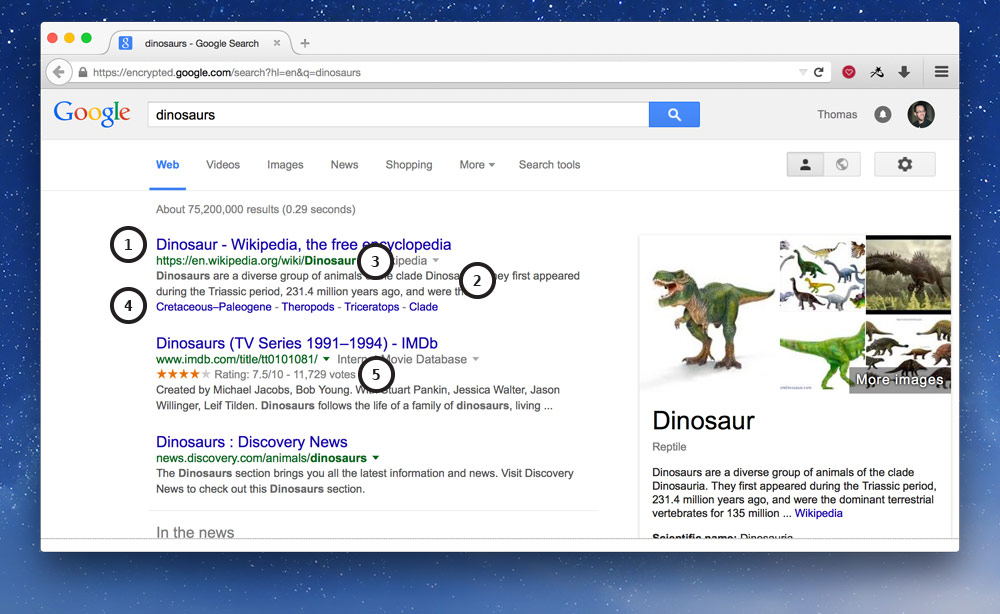

# Search engine optimization & metadata

A quick overview of important SEO concerns for a website, important tags, and important data.

---

## Google is smart, but only so smart

- Google is smart about figuring out what content is good
- And good at determining relevance

_But with SEO we can give them a little help_

---

## Things that matters

- Human-friendly text—with minimal, semantic code
- Clear information hierarchy
- First line of first paragraph
- Links to your site from reputable sources
- Clean, meaningful URLs & filenames
- Metadata: enhanced semantics, rich information
- Speed, security & responsiveness

---

## Tags that matter

- `<title>`
- `<meta name="description">`
- `<h1>`, `<h2>`, `<h3>`, etc.
- First line of the first `
`
- `<a>`
- ``
- `<strong>`, `<em>`

---

## Google search results layout

Google uses information from your website in its search results listings in the following ways:

- The `<title>` of your page is the big blue link
- The `<meta>` description or text from the first 
 is the description under the link
- The page URLs are used to highlight keywords
- Google can pull out important pages and links from navigation or breadcrumbs
- Extra info like ratings, votes, times comes from your metadata

---

## Page title

**The title must be unique for every single page.**

- _Homepage title pattern:_  “Site/Company Name · Small keyword rich, catchy phrase · City, Country”

- _Inside page title pattern:_  “Page Title · Site/Company Name”

---

## Page description

**The page description must be unique for every single page and max 150 characters.**

- A short sentence describing the purpose and content of this individual page.
- Use appropriate keywords.
- Write real sentences for humans — keyword stuffing will be penalized.

---

## Social media

When you share something on Facebook or Twitter (et al.), the little preview is defined by specific tags.

_Each platform will have a different way to denote these tags._
